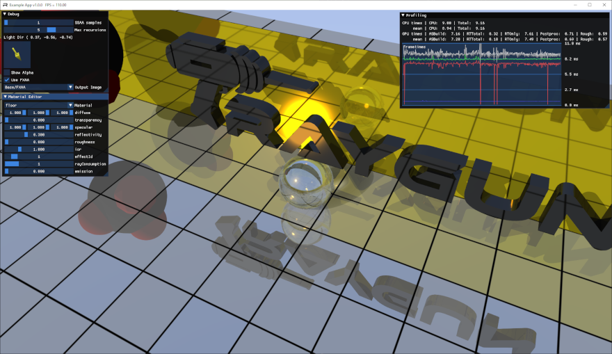

    

Raygun is a simplistic game engine built around [NVIDIA Vulkan Ray Tracing].
Therefore, a GPU supporting NVIDIA Ray Tracing is required.

[PhysX] is used as physics engine, while [OpenAL] enables audio support.
For window and input management, [GLFW] is utilized.
Debugging and profiling information is displayed via [ImGui].

[NVIDIA Vulkan Ray Tracing]: https://devblogs.nvidia.com/vulkan-raytracing/
[PhysX]: https://www.geforce.com/hardware/technology/physx/
[OpenAL]: https://openal-soft.org/
[GLFW]: https://www.glfw.org/
[ImGui]: https://github.com/ocornut/imgui/

    

## Features

- Vulkan-based renderer using NVIDIA Ray Tracing extension
  - Compute-shader support
  - Integrated profiler
  - Validation layer enabled (in debug builds)
  - Vulkan debug messenger extension support
  - Using dynamic dispatcher for all Vulkan calls
  - Convenience wrappers for commonly used Vulkan objects
  - Extensible material system
  - Reflections and refractions
  - Screen-space roughness approximation
  - Fade transitions
  - SSAA and FXAA
- [ImGui] integration
  - Debug menu
  - Live material editing
  - Performance visualization
- [PhysX] integration
  - Convenience functions for common tasks
  - Trigger / collision callbacks
  - Underlying PhysX objects still accessible
  - PhysX Visual Debugger support (in debug builds)
- [GLFW] window system integration
  - Window resize / minimize support
  - Handling of keyboard input
- [OpenAL] based audio system
  - Positional sound effects
  - [Opus](http://opus-codec.org/) support
- User interface
  - Automatic arranging of controls
  - [ImGui] inspired API
  - Ray traced
- Resource manager
  - Automatic caching of loaded resources
  - [Collada](https://www.khronos.org/collada/) support
- Scene graph
  - Custom entities via inheritance
  - Animated entity support
- Config load / store
- Integrated logging
- Scene reloading (F5) (example project)
- Hot shader reloading (F6)

## Development Notes

- Shaders are automatically compiled at build-time
- Use Vulkan SDK `1.1.126`
- For generating fonts using the provided script, `blender.exe` should be in `PATH`
- A Blender plugin is provided to enable instant scene export

Build instructions are available for [Windows](docs/build_instructions_windows.md) and [Linux](docs/build_instructions_linux.md).

## Third-Party

Third-party dependencies are included for a good out-of-the-box experience.
Note that these dependencies are provided under their own respective license.

UI sounds by [Lokif (OpenGameArt.Org)](https://opengameart.org/content/gui-sound-effects/) (CC0).

Music by [David Fesliyan](https://www.fesliyanstudios.com/royalty-free-music/download/lone-rider/174) (Non-Commercial).
Royalty free music from <https://www.fesliyanstudios.com>.

## Acknowledgement

Big thanks to Ingrid Frank for creating the official Raygun logo (font: [Ethnocentric](https://www.dafont.com/ethnocentric.font)).
Checkout [her amazing work](https://www.facebook.com/FideDraws/).
